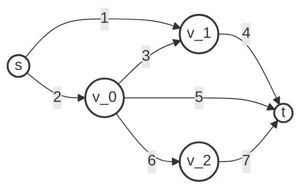

# Prüfungsübersicht: Rechnernetze & Verteilte Systeme

## Aufgabe 1: MC-Fragen (20 Punkte)
* **Umfang:** 10 Fragen à 2 Punkte.
* **Inhalt:** Alle Vorlesungen aber insgebsondere Fokus auf VL 10 und folgende.
* **Bewertung:** Pro Teilaufgabe 0 oder 2 Punkte (keine Teilpunkte für unvollständige Kreuze).

---

## Aufgabe 2: Packet Classification (26 Punkte)

### Regel-Tabelle
| Rule # | Source | Destination | Destination Port | Action |
| :--- | :--- | :--- | :--- | :--- |
| 1 | 8.0.0.0/5 | 11.11.0.1 | 80 | Deny |
| 2 | 10.0.0.0/8 | 11.11.0.1 | 22 | Allow |
| 3 | 10.128.0.0/9 | 12.0.0.0/24 | 80 | Allow |
| 4 | 128.0.0.0/1 | 12.0.0.0/24 | 22 | Deny |

### Teilaufgaben
* **a) Binärdarstellung:** Source-Spalte umwandeln (Beispiel: `192.0.0.0/2 -> 11*`).
* **b) LPM Baum:** Zeichnen für Source Feld. Pfadkompression optional. Zusätzlich von rechts nach links möglich.
* **c) Bit-Vektor Tabelle:** Ausfüllen der Matrix:

| Index | Source | Destination | Destination Port |
| :--- | :--- | :--- | :--- |
| 1 | | 11.11.0.1 (1100) | |
| 2 | | | |
| 3 | | | |
| 4 | | | |

* **d) Klassifizierung (T3):**
    * **Gegeben:** Source: 10.130.5.7, Dest: 12.0.0.45, Port: 80.
    * **Frage:** Erkläre die Klassifizierung in T3 mithilfe des Paketklassifikationsalgorithmus. Falls (c) nicht gelöst, beschreibe, was man anwenden würde.

---

## Aufgabe 3: Netzwerkfluss

*Hinweis: Alle Links besitzen eine Kapazität von **120 Mbit/s**.*

### Pfad-Definitionen
* **Pfad A:** $s \to v_1 \to t$
* **Pfad B:** $s \to v_0 \to v_1 \to t$
* **Pfad C:** $s \to v_0 \to t$
* **Pfad D:** $s \to v_0 \to v_2 \to t$

### Teilaufgaben
* **a)** Für jeden Fluss die durchschnittliche Übertragungsrate.
* **b)** **Maximieren der Summe:** Welchen Link anpassen, um die Summe zu maximieren? Wo ist der neue Bottleneck?
* **c)** **Vollständige Kontrolle:** Wie kann man die Gesamtsumme erhöhen (ohne Kapazitätserhöhung)?

---

## Aufgabe 4: Collective Communication

**Erklärung eines Simplen Algorithmus (Pseudocode zwischen n Nodes):**

* **a)** Welche Collective Communication Operation?
* **b)** Kosten nach $(\alpha, \beta)$-Modell und Vergleich mit Butterfly.
* **c)** Aspekte, die im $(\alpha, \beta)$-Modell nicht berücksichtigt werden.

